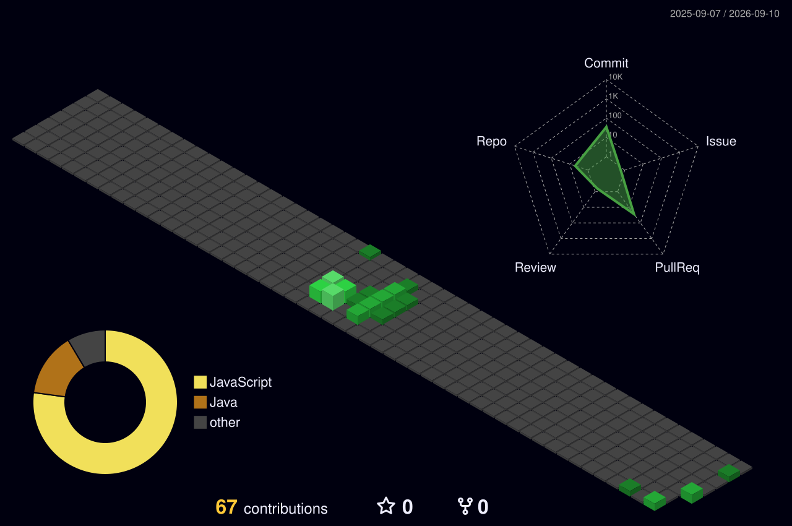

  <!-- Banner animado estilo Terminal (Parpadeo) -->
  

  <!-- Efecto máquina de escribir limpio -->
  

---

### 💻 Sobre Mí

Soy un desarrollador de software (Estudiante de SENATI) con sólida experiencia en entornos empresariales. Me especializo en construir arquitecturas robustas y experiencias de usuario dinámicas, adaptándome rápidamente a diferentes stacks.

*   ⚡ **Backend:** Escalabilidad y APIs con NestJS, Node.js y Python.
*   📱 **Mobile & Frontend:** Desarrollo multiplataforma con Dart/Flutter y React.
*   🚀 **Filosofía:** Clean Code, arquitecturas limpias y automatización.

---

### ⚙️ Stack Tecnológico

  

  

---

### 🏢 Historial de Proyectos Empresariales

A lo largo de mi carrera, he colaborado en la construcción de múltiples sistemas empresariales:

1.  **Garrison:** Desarrollo del ecosistema Frontend y backend para la gestión avanzada de recursos.
2.  **Proyecto EPIK:** Plataforma corporativa de eventos. Implementación de UI/UX avanzada, animaciones complejas y pasarelas de backend.
3.  **Proyecto Imporisel:** Arquitectura Full-Stack para el sistema de importaciones y clientes.
4.  **Miskipop & Marketing Lima:** Soluciones integrales de software y mantenimiento.

---

### 🏙️ Mi Actividad (GitHub 3D Matrix)

  <!-- Gráfico 3D en versión Night (Oscuro) y Verde Matrix -->
  

---

  <!-- Estadísticas corregidas con tu usuario abeljosue -->
  

