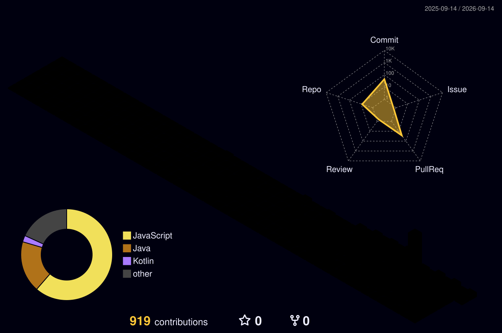

  
   
  <h1> 👨‍💻 Abel Huanca | Desarrollador Full-Stack & Mobile</h1>

---

> *"Transformando café en código, escalando arquitecturas backend y diseñando interfaces dinámicas."* ⚡

### 💻 Sobre Mí

Soy un desarrollador de software (Estudiante de SENATI) con sólida experiencia en entornos empresariales. He participado en la construcción y despliegue de múltiples sistemas, adaptándome rápidamente a diferentes stacks y arquitecturas. 

*   🛠️ **Mi enfoque:** Backend robusto (NestJS, Node, Python) y Frontend de alto rendimiento (React).
*   📱 **Mobile:** Desarrollo multiplataforma nativo y ágil con Flutter.
*   🚀 **Filosofía:** Clean Code, diseño responsivo 100% y automatización.

---

### ⚙️ Stack Tecnológico

  

  

---

### 🏢 Historial de Proyectos Empresariales

A lo largo de mi carrera, he colaborado en múltiples ecosistemas de software a medida:

1.  **Garrison:** Desarrollo del ecosistema Frontend y backend para la gestión avanzada de recursos.
2.  **Proyecto Imporisel:** Arquitectura Full-Stack para el sistema de importaciones y clientes.
3.  **Proyecto EPIK:** Plataforma corporativa de eventos. Implementación de UI/UX avanzada, animaciones y conexión de pasarelas en el backend.
4.  **Miskipop & Marketing Lima:** Desarrollo y mantenimiento de soluciones de software escalables.

---

### 🏙️ Mi Actividad (GitHub 3D Contribution Grid)

  <!-- El workflow generará esta imagen 3D de neón automáticamente -->
  

---

  

